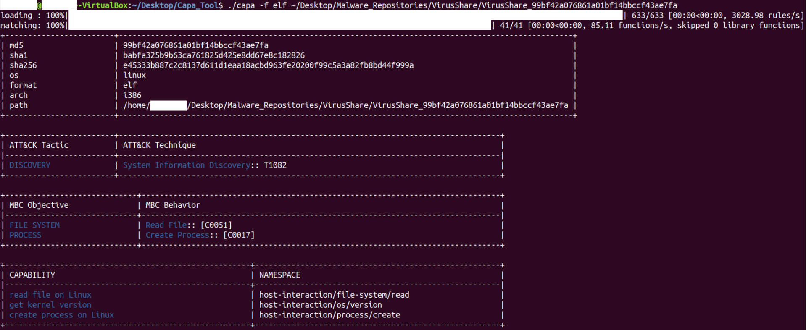

# Research Paper
The tool in this repository was developed as part of a project conducted at the Royal Holloway University of London [Centre for Doctoral Training in Cyber Security](https://www.royalholloway.ac.uk/research-and-teaching/departments-and-schools/information-security/studying-here/centre-for-doctoral-training-in-cyber-security-for-the-everyday). For further information, please refer to the paper [Evaluating Anti-Virus Effectiveness in Linux](https://doi.org/10.1109/BigData55660.2022.10020475), which was presented at _The 6th International Workshop on Big Data Analytic for Cyber Crime Investigation and Prevention_ (IEEE International Conference on Big Data 2022). 

# Introduction
The _capa-tool-launcher_ is a tool to launch the [Mandiant capa tool](https://www.mandiant.com/resources/capa-automatically-identify-malware-capabilities) for the analysis of multiple repositories, and to postprocess the obtained results. The _capa-tool-launcher_ is currently implemented as a Python script (`capatoolauncher.py`) that makes use of a module (`capapostprocesslib.py`) containing classes developed for postprocessing-related tasks. Additional information on the most recent releases of the capa tool can be found in these blog posts:

* [capa 2.0: Better, Stronger, Faster](https://www.mandiant.com/resources/capa-2-better-stronger-faster)
* [ELFant in the Room – capa v3](https://www.fireeye.com/blog/threat-research/2021/09/elfant-in-the-room-capa-v3.html)

# Main Features
The _capa-tool-launcher_ relies on the capa standalone binary, which can be executed as illustrated in the following figure.

While Mandiant provide their tool as a Python module as well, using the standalone binary is advantageous as it does not require any installation. In essence, the script `capatoolauncher.py`, which includes a command-line interface implemented with the Python Standard Library module `argparse`, allows executing the relevant binary by using the **Linux** shell. It should be observed that:

* The tool was implemented and tested under **Linux**. Ubuntu Linux 18.04 LTS was used both for development and testing.
* The tool is currently compatible with **Python version 3.6.9**.
* The capa version **v3.0.2** was used during the latest tests conducted with the _capa-tool-launcher_.

Since the Linux shell is used to launch the capa binary, the tool relies on the _exit codes_ for a high-level classification of the executions. This means that the execution of a test is categorized as _Successful_ if the returned exit code is zero, though the author has observed that this does not necessarily mean that capa has identified any capabilities. When an exit code different from zero is obtained, e.g., because the analysed sample does not target a supported OS or a supported architecture (see examples in the following figure), the tool attempts to process stderr to extract relevant information, which is then logged in the generated summary report. When the process of extracting this information fails, the test execution is classified as _Other_.

In addition, tests performed during the development of the _capa-tool-launcher_ show that in some cases the execution time is unexpectedly long, and, when this happens, the OS automatically kills the execution without yielding any results. As this tool was primarily conceived to support researchers and analysts who need to process large file repositories, the capa binary is launched with the Linux command `timeout` to avoid slowing down the analysis unnecessarily.

Finally, as shown in the example below, the tool includes a command-line interface, which can be displayed with the `-h` option (i.e., `python3 capatoolauncher.py -h`), and supports different execution modes, as illustrated in a dedicated section included in this guide.

# Known Issues and Limitations
The following known issues and limitations should be considered prior to starting using the tool:

* **Security**. To facilitate the redirection of the capa results to a JSON file, which is possible by calling the standalone binary with the `-j` option (automatically done by the _capa-tool-launcher_), `shell=True` was used in the interface towards the Linux shell (i.e., as input argument to the `subprocess` module function used to access the shell). This implies that the tool should **not** be used with an **unchecked** configuration file, as execution of arbitrary code is possible. Details about are the tool configuration file are provided as part of the description of the analysis execution mode.
* **Python version**. More recent Python versions than the one used to develop and test the tool include an updated version of the Standard Library module `subprocess`. Consequently, it is **not** at all guaranteed that the current implementation of the _capa-tool-launcher_ works with these versions of the language.
* **Timeout duration**. The duration of the above-mentioned timeout is currently set to 5 minutes. This parameter is **not** included in the configuration file. This is an improvement to be considered for future releases to allow users to further tailor their analysis set-up.
* **Merge mode**. The tool **cannot** currently be launched in merge mode multiple times with the same target folder. The presence of previously generated merged reports, in fact, breaks the postprocessing code. Should re-running the tool in merge mode with the same target folder be necessary, then the merged reports will have to be deleted manually first.        

# Execution Modes
The purpose of this section is to illustrate the tool execution modes. The corresponding command-line options along with implementation strategies and limitations are described.

## Remove Results Mode
The tool generates a set of report files (`*.txt` and `*.csv` files) and log files (`*.log` files) within a dedicated folder called `reports`. Each test execution creates a subfolder with a timestamp (e.g., `test_oct_25_17_48_43`), so results obtained with different tests can easily be distinguished. To delete the contents of the `reports` folder, launch the tool with the `-r` option, as shown in this example:

* `python3 capatoolauncher.py -r`  

## Analysis Mode
To process with capa one or more file repositories, launch the tool in analysis mode with the `-f` option, which requires a configuration file in YAML format. A template for the latter is provided within the folder `config`. This is an example of execution in analysis mode:

* `python3 capatoolauncher.py -f FalseNegativesAnalysis.yml`

As shown in the provided template, a configuration file must be stored in the `config` folder and include:

* Information about the capa standalone binary. Within the entry dedicated to it, the tag `Format` can be specified as well. This allows executing the capa tool with a specific file format option (see [capa documentation](https://www.mandiant.com/resources/capa-automatically-identify-malware-capabilities) for more details). The default file format for the _capa-tool-launcher_ is ELF, which means executing capa with the option `-f elf`.
* Information about the repositories containing the files to be processed. The repository names will be used to identify the generated report files and to create dedicated subfolders within the test execution-specific folder contained in `reports`.       

It is also worth noting that the tool automatically launches capa with the `-j` option, which means that the information about the capabilities detected in a processed file is provided in JSON format.

Finally, for each tested repository:

* A summary test report (`.txt` file) is created. No detailed file-level information though is included in the summary report.
* A log file (`.log` file) is generated. Only information about the files that were **not** successfully processed by capa is included.

## Postprocessing Mode
The _capa-tool-launcher_ currently supports two distinct postprocessing modes, which are identified with the numbers 1 and 2. The tool will typically be launched in postprocessing mode (`-p`) after completing an execution in analysis mode. This is an example of execution in postprocessing mode, which requires the test execution-specific folder as well as the type of postprocessing:  

* `python3 capatoolauncher.py -p test_oct_19_18_22_39 1`   

**Postprocessing type 1** analyses and provides summaries of the highest-level capabilities identified by capa. For instance, if capa reports the fully-categorized capability `host-interaction/network/interface` only the information associated to `host-interaction` will be considered. This allows obtaining reports that provide a succinct characterization of the detected capabilities. Repository-specific reports are generated as `*.txt` files.

**Postprocessing type 2**, by contrast, provides detailed per-file summaries. The generated reports (`*.txt` files) are tested repository-specific and include all the capability identified in a given file. It should be noted that, in these reports, 1 means detected capability, whereas 0 means capability not identified. Multiple occurrences of the same capability are possible within a file, but the report will always include 1, rather than the actual number of occurrences, for simplicity.       

## Complete Execution Mode
The complete execution mode (`-c`) enables the user to chain together the analysis and the postprocessing modes. This implies that the postprocessing starts as soon as the analysis finishes. This is an example of complete execution mode, which requires a configuration file as well as a postprocessing type:  

* `python3 capatoolauncher.py -c FalseNegativesAnalysis.yml 1`

## Merge Mode
The analysis and the postprocessing modes generate reports that are tested repository-specific. However, researchers and analysts might well need to compare the results obtained with different repositories. To facilitate this process, the merge mode (`-m`) allows creating CSV files (`*.csv`) that assemble information extracted from the repository-specific reports. This is an example of merge execution mode, which requires the test execution-specific folder:

* `python3 capatoolauncher.py -m test_oct_25_17_48_43`

It should be observed that to merge the reports created with postprocessing type 2, a set of temporary files (`*.txt`) is generated, processed and then automatically deleted. However, the current implementation of the tool reports their names in the final merged report, but this does not affect its clarity, as the names of the tested repositories are included in the temporary file names.    
